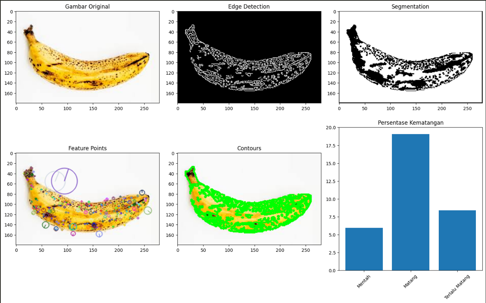

# 🍌 Banana Ripeness Detection System
## Computer Vision-based Banana Ripeness Analysis


[](https://www.python.org/downloads/)
[](https://opencv.org/)
[](LICENSE)

> An advanced computer vision system that analyzes banana ripeness using multiple image processing techniques and machine learning algorithms.

## 🚀 Features

- **Multi-Stage Analysis**
  - Color Analysis (HSV & LAB Color Spaces)
  - Texture Analysis (SIFT Features)
  - Shape Analysis (Contour Detection)
  - Segmentation (Watershed Algorithm)

- **Comprehensive Visualization**
  - Original Image Processing
  - Edge Detection Results
  - Feature Point Mapping
  - Contour Visualization
  - Ripeness Distribution Charts

- **Advanced Detection**
  - Three-stage ripeness classification
  - Percentage-based analysis
  - Confidence scoring
  - Dark spot detection

## 📋 Requirements

```txt
opencv-python>=4.5.0
numpy>=1.19.0
scikit-learn>=0.24.0
matplotlib>=3.3.0
```

## 🛠️ Installation

1. Clone the repository:
```bash
git clone https://github.com/notsuperganang/Banana-Ripeness-Detection
cd banana-ripeness-detection
```

2. Create and activate virtual environment (optional but recommended):
```bash
python -m venv venv
source venv/bin/activate  # Linux/Mac
.\venv\Scripts\activate   # Windows
```

3. Install dependencies:
```bash
pip install -r requirements.txt
```

## 💻 Usage

### Basic Usage

```python
from banana_detector import BananaRipenessDetector

# Initialize detector
detector = BananaRipenessDetector()

# Analyze image
results = detector.detect_ripeness('path/to/banana.jpg')

# Visualize results
detector.visualize_results('path/to/banana.jpg', results)
```

### Jupyter Notebook

We provide a comprehensive Jupyter notebook demonstrating the system's capabilities:
```bash
jupyter notebook Banana_Ripeness_Analysis.ipynb
```

## 📊 Example Results

### Input Image


### Analysis Results


```python
Results:
Ripeness Level: Ripe
Percentages:
- Unripe: 5.97%
- Ripe: 19.07%
- Overripe: 8.42%
```

## 🔬 Technical Details

### Color Ranges (HSV)
- **Unripe**: H(25-35), S(50-255), V(50-255)
- **Ripe**: H(20-30), S(100-255), V(100-255)
- **Overripe**: H(0-20), S(50-255), V(20-255)

### Processing Pipeline
1. Image Preprocessing
2. Edge Detection
3. Feature Extraction
4. Segmentation
5. Ripeness Analysis
6. Visualization

## 📝 Project Structure

```
banana-ripeness-detection/
├── examples/
│   ├── input.jpg
│   └── results.jpg
├── notebooks/
│   └── Banana_Ripeness_Analysis.ipynb
├── requirements.txt
└── LICENSE
└── README.md
```

## 🤝 Contributing

Contributions are welcome! Please feel free to submit a Pull Request.

1. Fork the repository
2. Create your feature branch (`git checkout -b feature/AmazingFeature`)
3. Commit your changes (`git commit -m 'Add some AmazingFeature'`)
4. Push to the branch (`git push origin feature/AmazingFeature`)
5. Open a Pull Request

## 📄 License

This project is licensed under the MIT License - see the [LICENSE](LICENSE) file for details.

## 🙏 Acknowledgments

- Computer Vision course at Syiah Kuala University
- OpenCV documentation and community
- scikit-learn documentation and community

## 📬 Contact

Ganang Setyo Hadi - [@notsuperganang](https://www.instagram.com/notsuperganang/) - ganangsetyohadi@gmail.com

Project Link: [https://github.com/notsuperganang/Banana-Ripeness-Detection](https://github.com/notsuperganang/Banana-Ripeness-Detection)

## 📚 Citation

If you use this project in your research, please cite:

```bibtex
@software{banana_ripeness_detection,
  author = {Ganang Setyo Hadi},
  title = {Banana Ripeness Detection System},
  year = {2024},
  url = {https://github.com/notsuperganang/Banana-Ripeness-Detection}
}
```

---
<p align="center">
  Made with ❤️ for 🍌
</p>